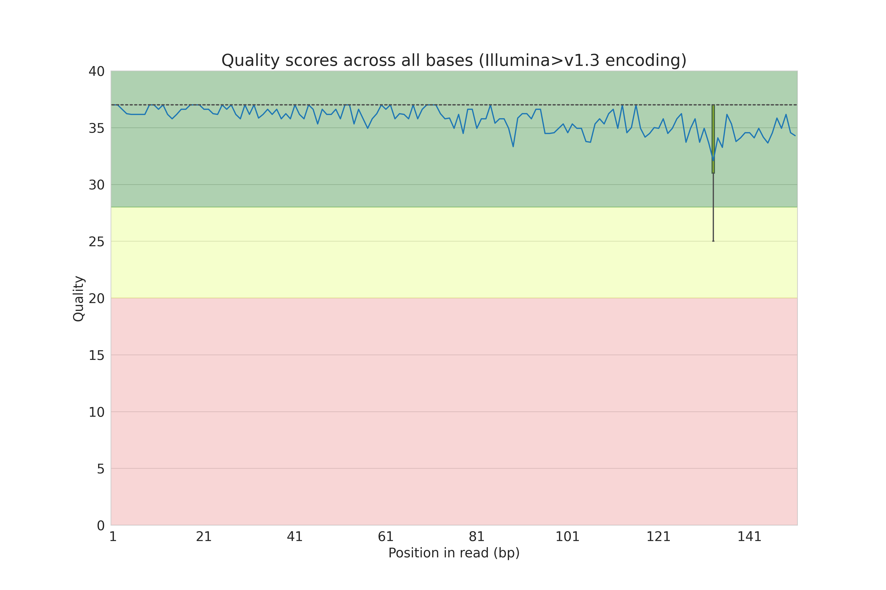
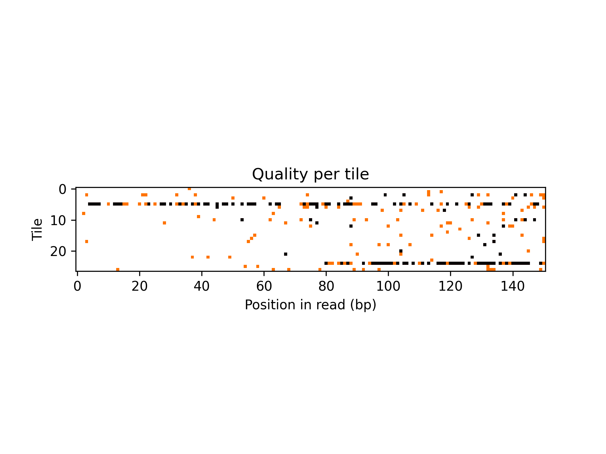
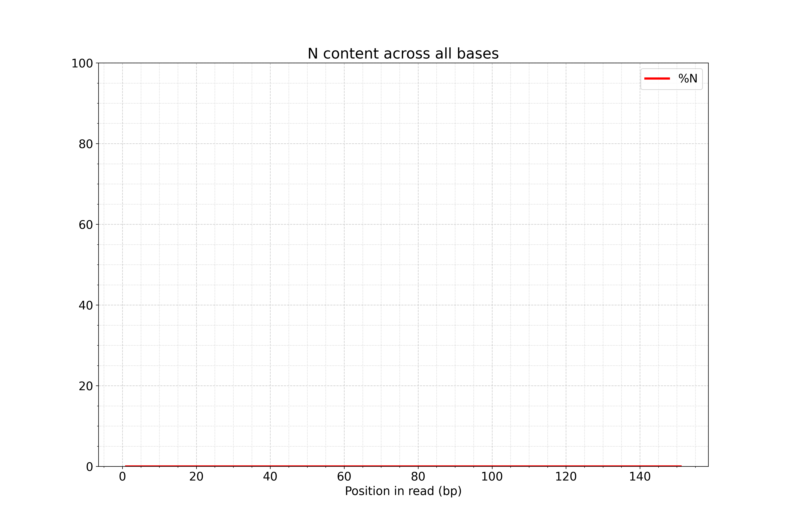
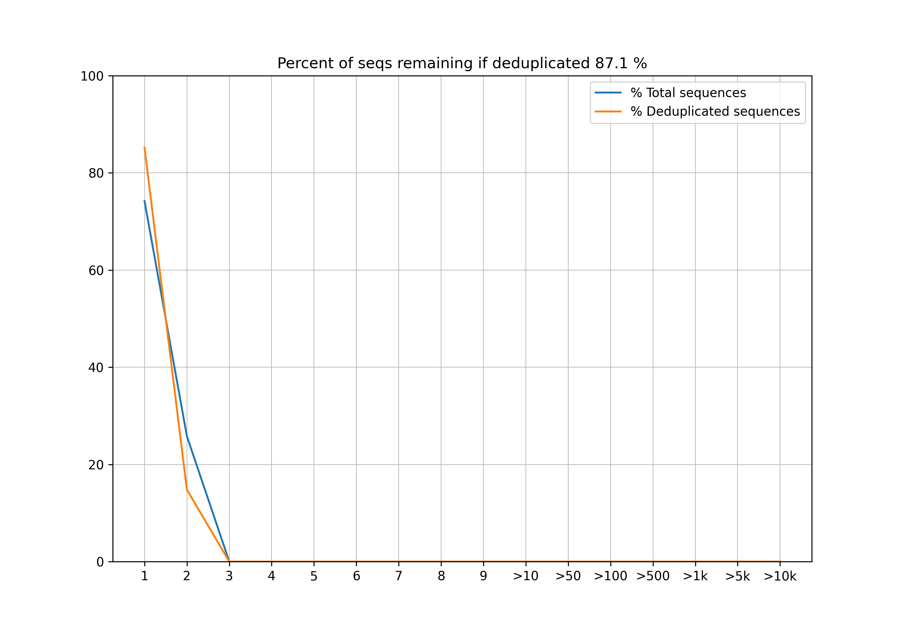

# BI_2021_fastqc

This is python project for python course in [Bioinnformatics Institute](https://bioinf.me/en). The fastqc.py is a script for sequencing reads quality control. The goal of the project was to reproduce metrics from the original widely used [FastQC tool from Babraham Institute](https://www.bioinformatics.babraham.ac.uk/projects/fastqc/) (Andrews, 2010). Our script fastqc.py provides the similar metrics and graphs, in particular: basic statistics (number of reads, average length), table of overrepresented sequences, plots of adapter content, per base n content, per base sequence content, per base sequence quality, per sequence quality score, sequence length distribution, per sequence GC content and sequence duplication levels. The program assumes quality encoding to be in Sanger/Illumina>1.3 (phred33) format. 

## Contributors

- Alexandra Kolodyazhnaya [@alvlako](https://github.com/alvlako) wrote functions to plot per sequence, per base and per tile quality score.
- Anastasiia Rusanova [@rusanovaA](https://github.com/rusanovaA) wrote functions to plot duplication levels and adapter content and to generate overrepresented sequences table.
- Anna Kapitonova [@anna-kapitonova](https://github.com/anna-kapitonova) wrote arguments parsing, main function, functions to plot GC content, sequence length distribution, per base sequence quality and per sequence GC content
- Vera Emelianenko [@Vera-Emelianenko](https://github.com/Vera-Emelianenko) wrote function for calculating basic statistics, tested and prettified the code (printing time, checking filepaths), wrote README. 

## Installation

The installation process does not rely on distinct OS features and can be applied for Windows, Linux and Mac systems. The script is supposed to be run from bash-like command line. To use it on Windows, please install Windows Subsystem for Linux (WSL) (this [user guide](https://www.windowscentral.com/install-windows-subsystem-linux-windows-10) can help you). Then you can run the commands in the WSL command line. The script is written and tested in Python3.8, and the installation process assumes you have python3 on your mashine. You can check the current version of python using `python --version`. To install or update Python, visit [www.python.org](https://www.python.org/downloads/).

#### OS requirements

The script was tested in WSL1 Ubuntu-20.04 in Windows Terminal 1.11.2921.0 in Microsoft Windows [Version 10.0.19043.1288] (Windows 10 Home Version 21H1), python 3.8.5, with the following dependencies: biopython 1.79, pandas 1.3.4, numpy 1.21.4, matplotlib 3.4.3, seaborn 0.11.2, scipy 1.7.2.

The script was tested in Ubuntu 18.04.2 LTS in Microsoft Windows [10.0.19043] (Windows 10 Home Version), python 3.6.9, with the following dependencies: biopython 1.78, pandas 1.1.5, numpy 1.19.5, matplotlib 3.3.4, seaborn 0.11.2, scipy 1.5.4.

#### Downloading
You can download the archive with fastqc.py and test data using wget:

```
wget https://github.com/Vera-Emelianenko/BI_2021_fastqc/archive/refs/heads/main.zip
unzip main.zip
cd BI_2021_fastqc-main
```
Alternatively, the archive with the content of the project can be downloaded via visual interface of GitHub. Go to *main* branch, choose green button "Code" on the upper right and download zip. Zip archive might be unpacked with any tool you have or with unzip (`unzip BI_2021_fastqc.zip`)

You can also download the project via git clone: 
```
git clone https://github.com/Vera-Emelianenko/BI_2021_fastqc.git
````

### Dependencies installation

Since fastqc.py requires some particular versions of libraries, listed in requirement.py, the easiest way to run the script is to create virtual environment first and to install all necessary dependencies there. 

Create virtual environment:
```
python3.8 -m pip install --upgrade pip setuptools virtualenv
python3.8 -m virtualenv pseudofastqc # you can give any name you like 
source pseudofastqc/bin/activate
```
Note: If you are using not the bash shell, you may want to use some other file listed in pseudofastqc/bin, for example to activate the environment in fish, run 
`source fastqc/bin/activate.fish`

When environment is activated, you will see its name in brachets somewhere in your command line, e.g.
```
(pseudofastqc) vera@LAPTOP-EAJJI10O /m/c/U/e/D/b/BI_2021_fastqc-main>  
```

Install all dependencies: 
```
python -m pip install -r requirements.txt
```

You should see the following message: 
```
Successfully installed biopython-1.79 cycler-0.11.0 kiwisolver-1.3.2 matplotlib-3.4.3 numpy-1.21.4 pandas-1.3.4 pillow-8.4.0 pyparsing-3.0.6 python-dateutil-2.8.2 pytz-2021.3 scipy-1.7.2 seaborn-0.11.2 six-1.16.0
```
Alternatively, you can install all the dependencies in requirements.txt manually. To install any module, run the following:

`pip3 install module`

Note: in case you decided to run it in Python2, we can not quarantee proper script work. In this case the modules have to be installed with `pip install module`

### Verifying the installation

To verify that the script works, you can run it on the test data: 

```
python fastqc.py -i test_data/test.fastq -o ./
```
If you see no error messages, you are all set! You can remove test results with `rm ./test*`. 

## Usage

To run fastqc from the command line, type

``` bash
python fastqc.py -i input_file_dir/input_file.fq -o output_file_dir
```

## Basic options

`-i <path_to_file>` (or `--input <path_to_file>`)
    Reads data in fastq format.
    
`-o <output_dir>` (or `--outdir <output_dir>`)
    Specify the output directory. The current directory is default `"./"`.

## Output files

All the output files will be prefixed by the name of the analysed file. 

#### basic_statistics.tsv

A tab-separated table that shows filename, number of sequences, sequence length range and average GC content. 

| Measure               | Value       |
|-----------------------|-------------|
| Filename              | test2.fastq |
| Total Sequences       | 31          |
| Mean sequence length  | 151.0       |
| Sequence length range | 151         |
| Average GC-content, % | 56.8        |

#### per_base_sequence_quality

Shows sequence quality across all bases. Assumes Sanger (phred33) encoding. 



#### per_tile_quality

Shows sequence quality per tile. Not generated if no tile information is provided. Assumes Sanger (phred33) encoding. 



#### per_sequence_quality_score

Shows distribution of quality per sequence. 


#### per_base_sequence_content

Shows sequence content per base. 


#### per_base_n_content

Shows n content per base. 


#### per_sequence_gc_content

Shows GC content across all sequences. 


#### seq_length_distribution

Shows how sequence lengths are distributed. 


#### sequence_duplication_levels

Shows total and deduplicated sequences. 


#### adapter_content
Shows per position adapter content


#### overrepresented_sequences

A tab-separated table that shows Sequence, Count anf Percentage for all the sequences that are more frequent than 0.1% and occure more than 1 time. 

| Sequence                                           | Count | Percentage        |
|----------------------------------------------------|-------|-------------------|
| GCCTGAAACTCGCGCCGCGAGGAGAGGGCGGGGCCGCGGAAAGGAAGGGG | 2     | 6.451612903225806 |
| TGAACACAAAATACTTTAAACAATTTAGAATAAAATATGAAACACTGTTT | 2     | 6.451612903225806 |
| TCTGTGCTGGAAAATGAATGCTCTGAGCTTTGGAAGCTCTCAGGGTACAA | 2     | 6.451612903225806 |
| TAACAAACAAACAAGTTTTCTCTTTTTAACAATTACCACATTCTGCGCTT | 2     | 6.451612903225806 |
| CCGCGCCCCGGCCCGGTGCAGCACCACCAGCGTGTCCAGGAAGCCCTCCC | 2     | 6.451612903225806 |

## References 

All the metrics were reproduces from the original FastQC program: 

Andrews, S. FastQC:  A Quality Control Tool for High Throughput Sequence Data [Online]. (2010) Available online at: [http://www.bioinformatics.babraham.ac.uk/projects/fastqc/](http://www.bioinformatics.babraham.ac.uk/projects/fastqc/)

First test data (test.fastq) is a subset of publicly available [SRR292678 Illumina reads](https://www.ncbi.nlm.nih.gov/sra/?term=SRR292678) (Escherichia coli O104:H4 str. TY-2482 Genome sequencing and assembly). 

Second test data (test2.fastq) is taken from the public [testdata repository](https://github.com/hartwigmedical/testdata), in particular from [cancerPanel folder, CPCT12345678R_AHHKYHDSXX_S13_L001_R2_001.fastq](https://github.com/hartwigmedical/testdata/blob/master/cancerPanel/CPCT12345678R/CPCT12345678R_AHHKYHDSXX_S13_L001_R2_001.fastq.gz)
